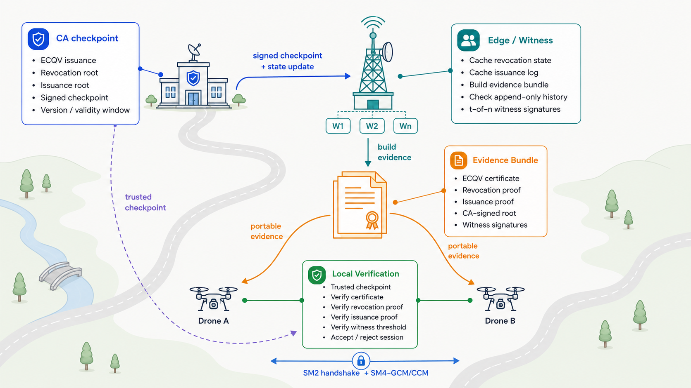

# TinyPKI

[](https://github.com/kakahuote1/TinyPKI/actions/workflows/ci.yml)
[](LICENSE)
[]()
[]()

TinyPKI 是一个面向资源受限设备、弱连接网络和边缘计算场景的轻量级 PKI 核心库。项目使用 C11 和 OpenSSL 3.x EVP 接口实现，以 SM2、SM3、SM4 为基础，覆盖证书签发、撤销证明、发证透明、认证握手和会话保护等主链路能力。

TinyPKI 聚焦三类角色：轻量化设备、边缘节点和 CA。设备保存自身证书、私钥和可信根状态；边缘节点缓存撤销状态和发证状态，并为设备构造可携带证据；CA 负责证书签发、撤销根发布和发证记录发布。验证端通过本地可信根、Merkle 证明和 witness 门限签名完成联合校验，减少对实时在线查询的依赖。

<p align="center">
  
</p>

<p align="center">
  <sub>TinyPKI 将 CA 签名检查点、边缘 witness 证据包和设备本地验证绑定在同一条链路中，使轻量设备在弱连接环境下完成证书、撤销状态和发证透明校验</sub>
</p>

## 项目定位

传统 PKI 在资源受限环境中通常面临证书载荷大、撤销状态同步慢、在线查询依赖强、边缘分区难处理等问题。TinyPKI 采用更紧凑的证书和证明结构，把证书身份、撤销状态、发证记录和边缘见证绑定到同一个验证流程中。

项目当前面向私有 PKI、边缘 PKI 和实验性安全系统。完整 WebPKI CT 生态由公共日志、监控者、审计者和浏览器策略共同组成；TinyPKI 采用更小的角色集合，在 CA、边缘节点与轻量设备之间构建适合受限网络的透明验证链路。

## 核心能力

### ECQV 隐式证书
设备提交证书请求后，CA 返回隐式证书材料和重构参数。设备使用自身临时私钥、CA 返回值和 CA 公钥重构最终密钥，验证端使用证书和 CA 公钥重构设备公钥。该设计减少证书内显式公钥和签名材料，适合低带宽认证场景。

### 路径压缩 Sparse Merkle 撤销树
撤销状态由 CA 发布的 Sparse Merkle root 承诺。已撤销证书使用 member proof，未撤销证书使用 absence proof。路径压缩避免固定展开大量空分支，过期撤销项可以移除，插入和删除不会挤动其他叶子位置。

### 追加式发证记录 (MMR)
发证记录按签发顺序写入证书承诺。TinyPKI 使用 Merkle Mountain Range 维护追加式记录，适合持续新增证书的场景。验证端可以检查某张证书是否进入发证记录，并将结果绑定到 CA 发布的统一根记录。

### 统一证据包
认证时，证据包可携带证书、撤销证明、发证证明、CA 签名根记录和 witness 签名。验证端重新计算撤销根和发证根，再比对 CA 签名根记录，避免把边缘节点的判断结果当作信任来源。

### 边缘 Witness 门限
边缘 witness 对 CA 发布根进行签名。客户端配置 `t-of-n` 策略后，证据包必须满足足够数量的 witness 签名。该机制用于约束 CA 发布根和发证历史，辅助发现隐藏签发、根分叉和边缘分区下的不一致状态。

### 撤销广播与同步
撤销状态发布支持 `nextUpdate`、delta 更新、heartbeat 续期、full checkpoint、重定向候选和 quorum 检查。该部分面向弱网和边缘分区环境，用于在同步频率、网络开销和状态新鲜度之间保持工程可控。

### 认证与会话保护
客户端完成证书、用途、撤销状态和发证透明校验后，可以进入 SM2 握手绑定流程，并使用派生密钥建立 SM4-GCM/CCM AEAD 会话。签名、握手转录本和会话参数共同绑定，降低重放和上下文混淆风险。

## 仓库结构

```text
include/                 公开头文件
src/ecqv/                ECQV 隐式证书实现
src/revoke/              撤销状态、Merkle 证明、同步和仲裁逻辑
src/pki/                 CA/RA 服务端、客户端和证据包主流程
src/auth/                签名、密钥协商和 AEAD 会话保护
src/app/                 演示程序和性能基准程序
tests/                   单元测试、集成测试和安全边界测试
tools/                   格式检查和格式化脚本
docs/                    安装说明、安全模型和审计记录
```

## 构建

依赖：

- C11 编译器
- CMake 3.14 或更高版本
- OpenSSL 3.x 开发库

Linux：

```bash
cmake -S . -B build -DCMAKE_BUILD_TYPE=Release
cmake --build build -j 4
ctest --test-dir build --output-on-failure
```

Windows MSYS2 UCRT64：

```bash
cmake -S . -B build -G Ninja -DCMAKE_BUILD_TYPE=Release
cmake --build build -j 4
ctest --test-dir build --output-on-failure
```

更完整的环境说明见 [docs/install.md](docs/install.md)。

## 测试

当前测试入口包括按领域拆分的 `ctest` suite 和聚合测试程序。按当前基线，`ctest` 包含 6 个 suite，`test_all` 聚合执行 108 个用例。

```bash
ctest --test-dir build --output-on-failure
./build/test_all
```

Windows 下聚合测试程序为：

```powershell
.\build\test_all.exe
```

格式检查：

```bash
bash tools/check_format.sh
```

Windows PowerShell：

```powershell
powershell -ExecutionPolicy Bypass -File tools\check_format.ps1
```

## 性能基准

TinyPKI 提供能力实验程序，用于测量证书载荷、证据包大小、撤销状态存储、查询时间、同步开销，并与 CRL、OCSP 和 CRLite 风格基线做本地对照。

```bash
cmake --build build --target sm2_bench_capability_suite -j 4
./build/sm2_bench_capability_suite ./tmp/bench_capability_suite.json
```

benchmark 输出包含固定 seed、commit、平台、编译器、预热轮数、正式测量轮数、median、p95、均值、标准差和稳定性标记。README 保持为项目入口，具体数值以当前 commit 运行出的 JSON 和同名 Markdown 报告为准。

## 集成

TinyPKI 生成静态库目标 `tinypki`。上层 CMake 项目可以通过子目录或子模块方式接入：

```cmake
add_subdirectory(TinyPKI)
target_link_libraries(your_app PRIVATE tinypki)
```

推荐从高层 PKI service/client 接口接入。内部 Merkle、认证和撤销原语主要服务于库内主流程，应用层直接组合这些原语容易绕过证据包、根记录和 witness 策略。

### 主要公开入口

- `include/sm2_tinypki.h`：一站式聚合头文件。
- `include/sm2_implicit_cert.h`：ECQV 隐式证书请求、签发、验证和密钥重构。
- `include/sm2_revocation.h`：撤销根记录、证明结构、同步计划与仲裁辅助能力。
- `include/sm2_pki_transparency.h`：发证透明、统一根记录和 witness 策略类型。
- `include/sm2_pki_service.h`：CA/RA 服务端高层接口。
- `include/sm2_pki_client.h`：设备客户端高层接口。
- `include/sm2_auth.h`：签名类型和 AEAD 模式常量。
- `include/sm2_pki_types.h`：统一错误码和公共基础类型。

## 安全边界

TinyPKI 默认网络和边缘节点都可能不可信。验证端重新计算证明，将结果绑定到本地可信的 CA 签名根记录和 witness 门限策略。边缘节点负责提供证据材料，验证结论由设备本地完成。

部署时需要关注以下边界：

- 私钥长期保护应使用安全芯片、可信执行环境或等价硬件能力。
- 设备本地状态支持认证和回滚检测；在攻击者可以整体恢复旧存储快照且设备缺少安全计数器、可信时钟或其他不可回滚小状态时，纯软件无法证明当前状态新于旧快照。
- 发证透明机制适用于 TinyPKI 的 CA、边缘节点和轻量设备模型。公共日志、独立监控者和浏览器强制策略属于完整 WebPKI CT 生态的额外组成。
- benchmark 结果用于工程对照和回归观察，目标部署环境仍应在真实硬件和网络条件下重新测量。

## 相关文档

- [CHANGELOG.md](CHANGELOG.md)：变更记录。
- [CONTRIBUTING.md](CONTRIBUTING.md)：贡献流程和检查要求。
- [SECURITY.md](SECURITY.md)：安全策略和漏洞报告方式。
- [docs/install.md](docs/install.md)：构建、测试和运行说明。
- [docs/security/threat_model.md](docs/security/threat_model.md)：威胁模型。
- [docs/security/security_audit_v0.1.0.md](docs/security/security_audit_v0.1.0.md)：安全审计记录。

## 许可协议

TinyPKI 使用 [Apache License 2.0](LICENSE) 许可协议。

## English Summary

TinyPKI is a lightweight PKI core library designed for resource-constrained devices, connection-constrained networks, and edge computing environments. Implemented in C11 utilizing the OpenSSL 3.x EVP interface, it leverages SM2, SM3, and SM4 algorithms to provide a complete pipeline for lightweight certificate management and secure communications.

The project introduces a unified verification flow that combines:
- **ECQV Implicit Certificates**: Compact certificates under 90 bytes where public keys are mathematically reconstructed, reducing transmission and storage overhead.
- **Path-Compressed Sparse Merkle Revocation Trees**: Deterministic accumulators for revocation states, allowing devices to verify member or absence proofs offline.
- **Merkle Mountain Range (MMR) Transparency Logs**: An append-only structure for issuance commitment validation to restrict CA behavior.
- **Edge Witness Threshold Policy**: Decentralized checkpoint signing to mitigate split-view attacks.
- **AEAD Session Protection**: SM2 key agreement and SM4-GCM/CCM encryption for high-throughput session protection.

For detailed installation guides, threat models, and integration examples, please refer to the documents under the `docs/` directory or check the Chinese sections above.
